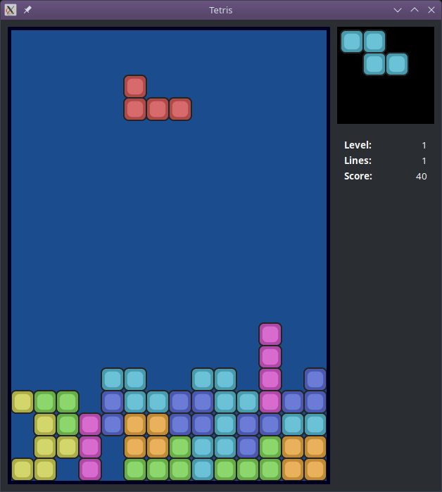

Tetris
------

Um tempo atrás estava brincando com o [Inkscape](http://www.inkscape.org/) e desenhei uns quadrados arredondados, e pensei “Puxa, esses quadrados bem que poderiam ser peças de Tetris”. Aí resolvi que alguma hora iria programar um Tetris. Até porque não conhecia nenhum Tetris bacana para Windows.

Fiz o programa em C++, e o resultado ficou bem bonitinho, como pode ser visto na figura abaixo (clique para ampliar):

Qualquer semelhança com o [Gnometris](http://live.gnome.org/Gnometris) (um dos Tetris para Linux) não é mera coincidência. Eu me baseei bastante nele; em particular, o algoritmo de pontuação é o mesmo, até porque não tinha idéia de que algoritmo inventar.

Download
--------

Quem puder, por favor teste o programa! Jogue, divirta-se e veja se não tem bugs esquisitos. A versão atual é do dia **12/2/2009** (sem número, por enquanto).

*   Versão para [**Linux**]() (indisponível). Esta versão foi compilada para GTK+ 2.14; para rodar num GTK anterior a esse, provavelmente será necessário recompilar (baixe o código-fonte para isso).
*   Versão para [**Windows**]() (indisponível). Provavelmente, se você rodar o tetris direto, ele vai reclamar que não achou uma DLL, mesmo que o GTK esteja instalado. Para funcionar direito, rode o programa loader.
*   [Código-fonte](https://github.com/edudobay/tetris-cpp-gtk2/archive/refs/heads/main.zip) (10 KiB). Para compilar no Linux, basta descompactar numa pasta, ir até essa pasta no terminal e digitar `make`. ([Mais informações](./README.md))

Ah, precisa de [GTK](http://www.gtk.org/) para rodar. No Linux já costuma vir instalado, qualquer coisa é só correr para seu gerenciador de pacotes. No Windows, instale esse trem aqui: [GTK+ 2.14.6 para Windows](http://downloads.sourceforge.net/pidgin/gtk-runtime-2.14.6-rev-a.exe?modtime=1231447823&big_mirror=1), ou algum outro “GTK+ Runtime” que achar por aí nas ruas.

Manual do usuário
-----------------

O programa não tem menus nem botões. Para jogar, use estas teclas:

*   **Setas** (esquerda/direita/baixo): movem a pecinha em uma unidade na direção correspondente.
*   **Seta para cima**: roda a pecinha no sentido anti-horário.
*   **Espaço**: derruba a pecinha até o final.
*   **N**: começa um novo jogo.
*   **P**: pausa/despausa o jogo.
*   **C**: termina o jogo atual.
*   **Q**: sai do programa.
